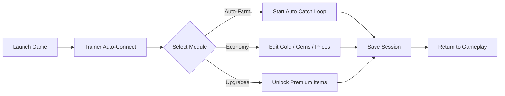

# Fish Idle 2 Trainer 🎣

The **Fish Idle 2 Trainer** is the essential enhancement tool for players who want to fish smarter, not harder. Designed for efficiency and automation, it streamlines the entire idle gameplay loop — from auto-catching fish to managing upgrades and unlocking high-tier equipment.

Whether you’re chasing legendary catches or building a massive fishing empire, this Trainer ensures you get there *without the grind.*

---


---

## 🌊 Overview

**Fish Idle 2** combines casual idle mechanics with incremental strategy — balancing your fishing crew, rods, and regions for exponential profits. The **Fish Idle 2 Trainer** automates this ecosystem, allowing you to skip repetitive actions and maximize income while you focus on progression.

Use it to automate catches, control upgrade costs, and even edit your offline profit multiplier for passive gains.

[!IMPORTANT]
This Trainer is fully compatible with **Fish Idle 2 v1.0.7** (Steam + PC). All modules operate offline, safely isolated from online leaderboards.

---

## ⚙️ Key Features

### 🎯 Auto-Farm Engine

* Automatically catches fish in all unlocked zones.
* Smart cooldown logic ensures zero downtime.
* Supports both manual and idle modes simultaneously.

### 💰 Infinite Economy Tools

* Set your gold, gems, or upgrade tokens to any value.
* Modify fish prices and sell multipliers in real time.
* Unlock premium rods, boats, and regions instantly.

### 🧩 Gameplay Optimization

* Freeze timers for research and upgrades.
* Boost crew speed or efficiency dynamically.
* Toggle instant achievements for quick unlocks.

### 🧭 Overlay Dashboard

* In-game compact trainer panel.
* Adjustable opacity and color themes.
* Custom hotkeys for automation toggles.

---

## 🧠 Compatibility Table

| Platform       | Status | Details                 |
| -------------- | ------ | ----------------------- |
| Steam          | ✅      | Verified build          |
| Epic Games     | ⚠️     | Partial overlay support |
| Windows 10/11  | ✅      | Stable                  |
| Linux (Proton) | ⚠️     | Requires DX12 override  |
| MacOS          | 🚫     | Not supported           |

[!NOTE]
All automation features are for **offline mode only** — avoid syncing leaderboards while Trainer is active.

---

## ⚡ Setup & Configuration

1. **Download** and extract the Trainer files.
2. **Place** the folder in your `Fish Idle 2` directory.
3. **Run** `FishIdle2_Trainer.exe` as administrator.
4. Launch the game normally — the Trainer will auto-attach.
5. Use the hotkey menu or in-game overlay to activate features.

```bash
# Example config.ini
auto_farm = true
gold_multiplier = 5.0
crew_speed_boost = 1.75
instant_upgrade = true
hotkey_toggle_overlay = F10
```

[!WARNING]
Antivirus tools may flag the Trainer’s memory hooks. These are safe and necessary for real-time in-game modification.

---

## 🧩 System Flow Diagram



---

## ❓ FAQ

**Q: Can I get banned for using this?**
A: No — this Trainer is **offline only** and does not interact with the leaderboard or server data.

**Q: Does it support Steam Cloud saves?**
A: Yes, but avoid saving while the Trainer is active to prevent sync errors.

**Q: Are there hotkeys for toggling features quickly?**
A: Yes. You can map any Trainer function to your own key combinations in `config.ini`.

**Q: How often is the Trainer updated?**
A: With each new Fish Idle 2 patch, updates are rolled out within 24–48 hours.

**Q: Can I use this with mods or custom texture packs?**
A: Absolutely — the Trainer operates independently of asset files.

---

## 🪄 Advanced Scripting (Optional)

You can create simple automation loops using script commands:

```lua
-- auto_sell.lua
while Trainer:isRunning() do
    if Player:inventoryFull() then
        Player:sellAll()
    end
    sleep(5)
end
```

Run these scripts by placing them in `/scripts` and enabling **Script Mode** in the overlay.

[!IMPORTANT]
Use custom scripts responsibly — excessive loops may reduce FPS on lower-end PCs.

---

## 🏆 Why Use the Fish Idle 2 Trainer?

* Eliminate grind with smart automation.
* Maximize efficiency and offline rewards.
* Instantly unlock items without paywalls.
* Enjoy full creative control over your idle empire.

This Trainer turns *Fish Idle 2* into a sandbox of possibilities — letting you explore every system freely, without limitation or repetition.

---

**Reel in infinite rewards — automate your fishing empire with Fish Idle 2 Trainer. 🎣**
